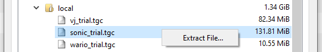
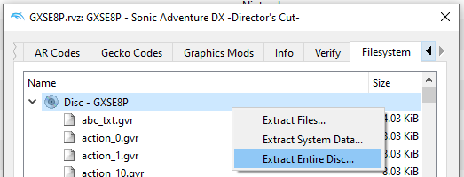

Sonic Adventure DX
=============

This repo contains a work-in-progress decompilation of Sonic Adventure DX for the Nintendo GameCube.

It builds DOLs and disassembles RELs for the following game versions:

- `Preview`: NTSC-J "Preview" Prototype
- `Review`: NTSC-U "Review" Prototype
- `GXSE8P-Demo`: NTSC-U Demo
- `GASJ8P-Demo`: NTSC-J Demo
- `GASJ8P`: NTSC-J Retail
- `GXSE8P`: NTSC-U Retail
- `GXSP8P-Demo`: PAL Demo
- `GXSP8P`: PAL Retail

Dependencies
============

Windows:
--------

On Windows, it's **highly recommended** to use native tooling. WSL or msys2 are **not** required.  
When running under WSL, [objdiff](#diffing) is unable to get filesystem notifications for automatic rebuilds.

- Install [Python](https://www.python.org/downloads/) and add it to `%PATH%`.
  - Also available from the [Windows Store](https://apps.microsoft.com/store/detail/python-311/9NRWMJP3717K).
- Download [ninja](https://github.com/ninja-build/ninja/releases) and add it to `%PATH%`.
  - Quick install via pip: `pip install ninja`

macOS:
------
- Install [ninja](https://github.com/ninja-build/ninja/wiki/Pre-built-Ninja-packages):
  ```
  brew install ninja
  ```
- Install [wine-crossover](https://github.com/Gcenx/homebrew-wine):
  ```
  brew install --cask --no-quarantine gcenx/wine/wine-crossover
  ```

After OS upgrades, if macOS complains about `Wine Crossover.app` being unverified, you can unquarantine it using:
```sh
sudo xattr -rd com.apple.quarantine '/Applications/Wine Crossover.app'
```

Linux:
------
- Install [ninja](https://github.com/ninja-build/ninja/wiki/Pre-built-Ninja-packages).
- For non-x86(_64) platforms: Install wine from your package manager.
  - For x86(_64), [WiBo](https://github.com/decompals/WiBo), a minimal 32-bit Windows binary wrapper, will be automatically downloaded and used.

Building
========

- Clone the repository:
  ```
  git clone https://github.com/doldecomp/sadx.git
  ```
- (Demo versions only) Using [Dolphin Emulator](https://dolphin-emu.org/), extract the relevant .tgc file to your games directory for Dolphin (`zz_sonic_game.tgc` for NTSC-U Demo, `sonic_trial.tgc` for NTSC-J Demo, `zz_SonicAdv.tgc` for PAL Demo).

- Still using Dolphin, extract your game to `orig/GXSE8P` (or `GASJ8P` for NTSC-J Retail, `GXSP8P` for PAL, etc.).  

  - To save space, the only necessary files are the following. Any others can be deleted.
    - `sys/main.dol`
    - `files/*.rel`
- (Non-Preview versions only) Using [Sonic Adventure Toolset](https://github.com/X-Hax/sa_tools), drag and drop the .rel files starting with an underscore (`_Main.rel` etc.) onto ArchiveTool.exe (found in the bin folder of SA Tools). This generates decompressed versions of the rels which are necessary for disassembly. The original rels should be deleted afterwards, and the new `_dec` rels renamed to their precedessors filenames.
- Configure:
  ```
  python configure.py
  ```
  To use a version other than `GXSE8P` (NTSC-U Retail), specify `--version GASJ8P` (NTSC-J Retail), `--version GXSP8P` (PAL Retail), `--version GXSE8P-Demo` (NTSC-U Demo), `--version Review` (NTSC-U "Review" prototype), and so on.
- Build:
  ```
  ninja
  ```
